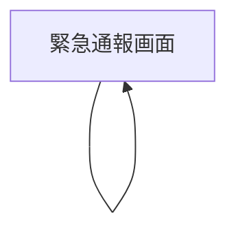

## 1. Product Overview
スマホ向けに、緊急時の音声入力を最短で通すための「極限までシンプルな」緊急通報UIへ刷新する。  
画面上の表示は spoken_text（音声認識結果）に限定し、入力言語に合わせて表示/応答言語を自動切替する。

## 2. Core Features

### 2.1 Feature Module
本プロダクト要件は、以下の最小ページで構成する：
1. **緊急通報画面**：spoken_textのみ表示、入力言語に合わせた多言語の表示/応答、音声応答出力。

### 2.2 Page Details
| Page Name | Module Name | Feature description |
|-----------|-------------|---------------------|
| 緊急通報画面 | spoken_text表示 | 音声認識結果（spoken_text）のみを画面に表示する（他テキスト/ラベル/ボタン表示をしない）。 |
| 緊急通報画面 | 入力言語の自動判定 | 入力音声（または音声認識結果）から言語を判定し、以降の表示言語と応答言語を一致させる。 |
| 緊急通報画面 | 応答生成（多言語） | 判定言語で応答テキストを生成する（ユーザーの入力言語に合わせる）。 |
| 緊急通報画面 | 応答出力（音声） | 生成した応答を判定言語で音声出力する（画面表示は spoken_text のみを維持）。 |

## 3. Core Process
- ユーザーフロー
  1) あなたが音声で状況を話す  
  2) アプリが音声を文字起こしして spoken_text を画面に表示する  
  3) アプリが入力言語を判定し、その言語で応答内容を生成する  
  4) アプリが応答を同一言語で読み上げる（画面の表示は spoken_text のみ）

