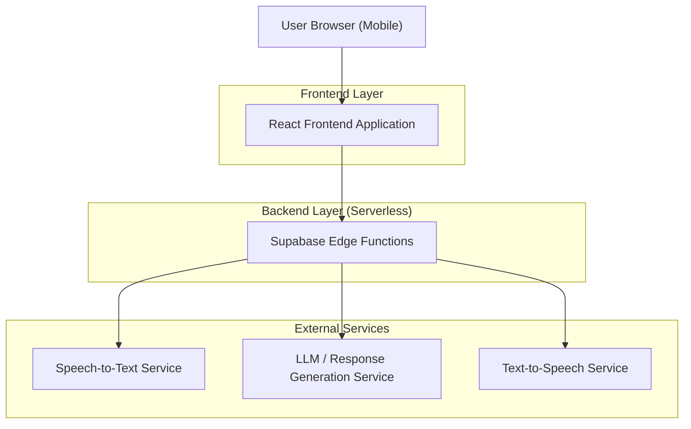
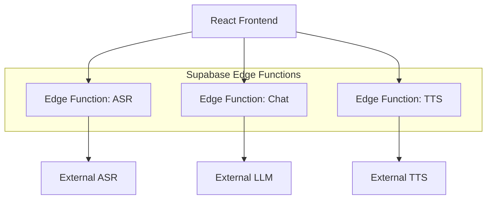

## 1.Architecture design


## 2.Technology Description
- Frontend: React@18 + TypeScript + tailwindcss@3 + vite
- Backend: Supabase Edge Functions（音声認識/応答生成/TTS の中継）

## 3.Route definitions
| Route | Purpose |
|-------|---------|
| / | 緊急通報画面（spoken_textのみ表示、入力言語に合わせた応答） |

## 4.API definitions (If it includes backend services)
### 4.1 Core API
音声認識（ASR）
```
POST /functions/v1/minimax-asr
```
Request（例）
| Param Name | Param Type | isRequired | Description |
|-----------|------------|------------|-------------|
| audio | Blob/Base64 | true | 録音音声データ |

Response（例）
| Param Name | Param Type | Description |
|-----------|------------|-------------|
| spoken_text | string | 音声認識結果（画面表示対象） |
| detected_language | string | 入力言語（例: ja, en, zh） |

応答生成（Chat）
```
POST /functions/v1/minimax-chat
```
Request（例）
| Param Name | Param Type | isRequired | Description |
|-----------|------------|------------|-------------|
| input_text | string | true | spoken_text |
| language | string | true | 応答言語（detected_language と一致） |

Response（例）
| Param Name | Param Type | Description |
|-----------|------------|-------------|
| response_text | string | 生成された応答テキスト（画面には出さず音声化に利用） |

音声合成（TTS）
```
POST /functions/v1/minimax-tts
```
Request（例）
| Param Name | Param Type | isRequired | Description |
|-----------|------------|------------|-------------|
| text | string | true | response_text |
| language | string | true | 読み上げ言語 |

Response（例）
| Param Name | Param Type | Description |
|-----------|------------|-------------|
| audio | Blob/Base64 | 音声データ |

### 4.2 Shared TypeScript Types（フロント/Functions間）
```ts
export type DetectedLanguage = 'ja' | 'en' | 'zh' | string

export type AsrResponse = {
  spoken_text: string
  detected_language: DetectedLanguage
}

export type ChatRequest = {
  input_text: string
  language: DetectedLanguage
}

export type ChatResponse = {
  response_text: string
}

export type TtsRequest = {
  text: string
  language: DetectedLanguage
}
```

## 5.Server architecture diagram (If it includes backend services)

