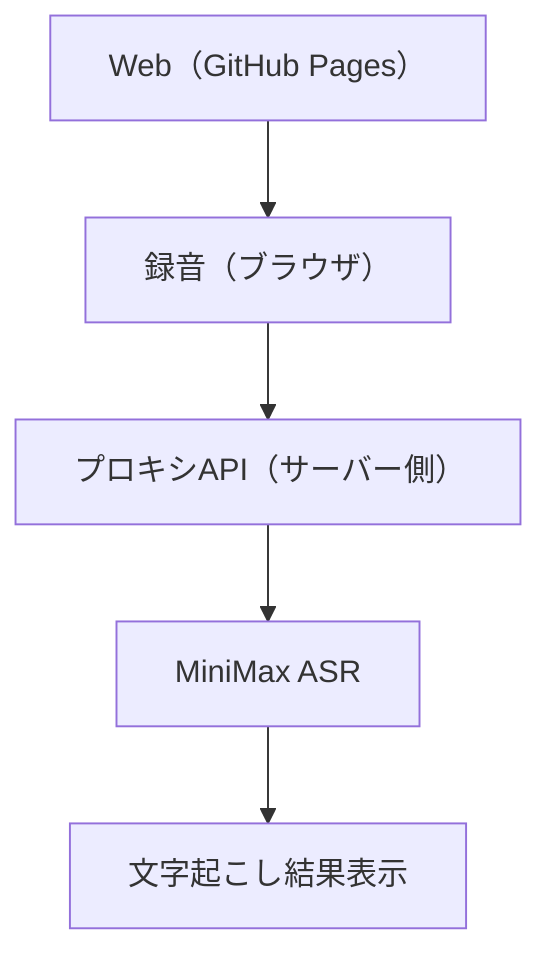

## 1. Product Overview
訪日外国人向けの「音声入力→文字起こし」をWebで体験できるデモ。
ブラウザで録音した音声をMiniMax ASRへ送り、文字起こし結果をGitHub Pages上で表示する。

## 2. Core Features

### 2.1 User Roles
| Role | Registration Method | Core Permissions |
|------|---------------------|------------------|
| 利用者（訪日外国人/デモ閲覧者） | 登録なし（Webアクセスのみ） | マイクで録音し、文字起こし結果を確認する |

### 2.2 Feature Module
本デモ要件は以下の主要ページで構成される：
1. **ホーム**：録音、送信、文字起こし結果表示。

### 2.3 Page Details
| Page Name | Module Name | Feature description |
|-----------|-------------|---------------------|
| ホーム | 録音 | 録音開始/停止、録音時間の表示、録音プレビューを提供する |
| ホーム | 文字起こし | 録音音声を送信し、文字起こし結果とエラー状態を表示する |
| ホーム | 設定ガイド | プロキシURL（公開情報）の設定手順を表示する |

## 3. Core Process
### 利用者フロー
1. GitHub Pagesのデモサイトを開く。
2. 録音開始→停止する。
3. 音声をMiniMax ASRへ送信し、文字起こし結果を確認する。

