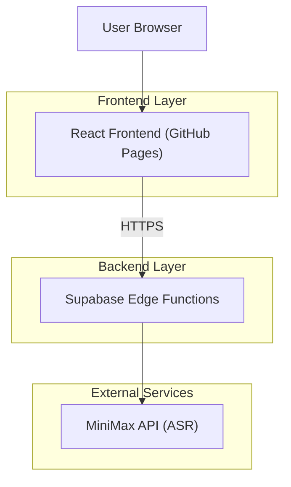
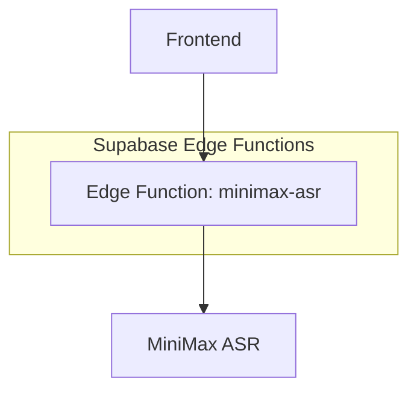

## 1.Architecture design


設計意図：
- GitHub Pagesは静的配信のみのため、MiniMax呼び出し（APIキー秘匿）をEdge Functionsに集約する。
- MiniMax APIキーはEdge Functionsの環境変数として保持し、クライアントへ直書きしない。

## 2.Technology Description
- Frontend: React@18 + TypeScript + Vite + tailwindcss@3（GitHub Pagesに静的ホスト）
- Backend: Supabase Edge Functions（TypeScript/Deno）
- External: MiniMax API（ASR）

## 3.Route definitions
| Route | Purpose |
|-------|---------|
| / | 録音→送信→文字起こし結果表示 |

## 4.API definitions (If it includes backend services)
### 4.1 Core API
#### フロントエンド向けAPI（プロキシ）
```
POST /minimax-asr
```
- 用途
  - 音声ファイルを受け取り、MiniMax ASRへ転送して文字起こし結果を返す

リクエスト（multipart/form-data）
- `file`: 音声ファイル
- `language`: 任意（例: `auto`）
- `model`: 任意（未指定時はサーバー側デフォルト）

レスポンス（application/json）
- `{ "text": "..." }`

### 4.2 Shared TypeScript Types（概念定義）
```ts
interface AsrResult {
  text: string
}
```

## 5.Server architecture diagram (If it includes backend services)


Secrets / Key management
- MiniMax API Key はEdge Functionsの環境変数へ設定する（フロントへ露出しない）。
- フロントからMiniMaxへ直接通信しない（必ずEdge Functions経由）。
